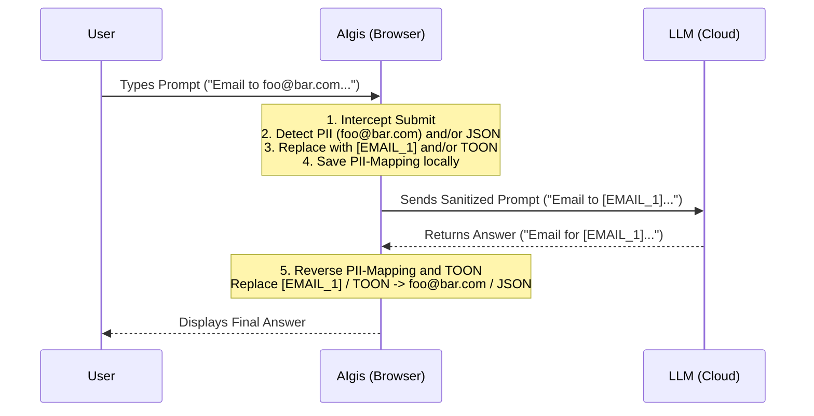

#  AIgis

> **Secure your AI interactions.**
> A browser extension that masks secrets and optimizes tokens in prompts locally before sending them to LLMs.


---

## What is AIgis?

**AIgis** (pronounced like *Aegis*, the mythological shield) is a "Client-Side Privacy Firewall" for Large Language Models.

Many companies and individuals hesitate to use tools like ChatGPT, Claude, or Gemini due to data privacy concerns ("Shadow AI"). **AIgis solves this by intercepting your prompt directly in the browser.** It sanitizes sensitive data (PII) and optimizes data structures to save tokens *before* the request ever leaves your device.

**Your data stays yours. The LLM provider only sees what you want them to see.**

## Features

### 🔒 1. Privacy & Sanitization
* **PII Detection:** Automatically detects and masks emails, IBANs, paths, IP addresses and more.
* **Custom Dictionaries:** Define your own "forbidden words" (e.g., internal project names like `Project Apollo`) that get replaced with  placeholders (`CUSTOM_X`).
* **Local Processing:** All logic runs in your browser. No data is sent to any 3rd party server for verification.

### ⚡ 2. Token Optimization (TOON)
* **JSON to TOON:** AIgis automatically detects bulky JSON inputs and converts them into TOON (Token-Oriented Object Notation) before sending.
* **30-60% Savings:** TOON strips away redundant syntax (brackets, quotes) to drastically reduce token usage and API costs without losing structural integrity.
* **Lossless & Reversible:** Fully round-trip capable. Data converted to TOON is semantically identical to the original JSON, ensuring the LLM understands it perfectly.

### 🔄 3. Restoration
* **Context Restoration:** AIgis re-injects the original data into the LLM's response, so you see the real data while the LLM only saw the placeholders.

---

## 🛠️ How it Works

AIgis operates as a browser extension injecting a content script into supported LLM interfaces.



---

## Installation

AIgis works on **all Chromium-based browsers** (Google Chrome, Microsoft Edge, Brave, Opera, Vivaldi, Arc, etc.).

Since it is currently in **active development** and not yet listed on the Web Stores, you can install it manually in less than a minute:

1.  **Download:** Go to the [Releases Page](../../releases) and download the latest `AIgis-vX.X.X.zip` (found under "Assets").
2.  **Unzip:** Extract the ZIP file into a folder of your choice.
3.  **Open Extensions Page:**
    * **Chrome / Brave / Opera:** Navigate to `chrome://extensions/`
    * **Microsoft Edge:** Navigate to `edge://extensions/`
4.  **Enable Developer Mode:** Toggle the switch **"Developer mode"** (usually in the top-right corner or left sidebar).
5.  **Load Extension:** Click the **"Load unpacked"** button.
6.  **Select:** Select the folder you just extracted.

**Ready!** AIgis is now active. We recommend pinning the extension icon to your toolbar for quick access to the toggle switch.

> **Security Note:** Every release includes a `.sha256` checksum file. You can verify the integrity of the downloaded ZIP against this hash to ensure the file hasn't been tampered with.

### 💻 For Developers (Build from Source)

If you want to contribute or audit the code:

```bash
# 1. Clone the repo
git clone [https://github.com/Karaatin/AIgis.git](https://github.com/Karaatin/AIgis.git)

# 2. Install dependencies
npm install

# 3. Build the project
npm run build

# 4. Load the 'dist' folder in Chrome/Edge (via "Load unpacked")
```
