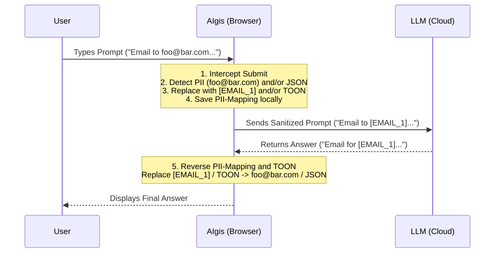

<div align="center">
  <a href="https://github.com/Karaatin/AIgis">
    
  </a>
  
  <h1><a href="https://karaatin.github.io/AIgis/"><strong>AI</strong>gis</a></h1>

  <p>
    <strong>Secure your AI interactions.</strong><br>
    A browser extension that masks secrets and optimizes tokens in prompts locally before sending them to LLMs.
  </p>

  <p>
    <a href="https://github.com/Karaatin/AIgis/blob/main/LICENSE"></a>
    
    
    
  </p>
</div>

---

## What is AIgis?

**AIgis** (pronounced like *Aegis*, the mythological shield) is a "Client-Side Privacy Firewall" for Large Language Models.

Many companies and individuals hesitate to use tools like ChatGPT, Claude, Gemini, DeepSeek, or Grok due to data privacy concerns ("Shadow AI"). **AIgis solves this by intercepting your prompt directly in the browser.** It sanitizes sensitive data (PII) and optimizes data structures to save tokens *before* the request ever leaves your device.

**Your data stays yours. The LLM provider only sees what you want them to see.**

## Features

### 🔒 1. Privacy & Sanitization
* **PII Detection:** Automatically detects and masks emails, phone numbers, IBANs, file paths, URLs, IP addresses and more.
* **Smart Developer Mode:** Switch between 'Strict' mode (masks everything) and 'Developer' mode (smartly ignores safe programming variables like `localhost`, `10.x.x.x` private network ranges, or standard paths like `./node_modules/` to avoid breaking system code inputs).
* **Custom Dictionaries:** Define your own "forbidden words" (e.g., internal project names like `Project Apollo`) that get replaced with placeholders (`[CUSTOM_1]`).
* **Local Processing:** All logic runs completely native within your browser. No data is sent to any 3rd party server for verification.

### ⚡ 2. Token Optimization (TOON)
* **JSON to TOON:** AIgis automatically detects bulky JSON inputs and converts them into TOON (Token-Oriented Object Notation) before sending.
* **30-60% Savings:** TOON strips away redundant syntax (brackets, quotes) to drastically reduce token usage and API costs without losing structural integrity.
* **Lossless & Reversible:** Fully round-trip capable. Data converted to TOON is semantically identical to the original JSON, ensuring the LLM understands it perfectly.

### 🔄 3. Restoration & Utilities
* **Context Restoration:** AIgis seamlessly re-injects your original string data directly into the LLM's response block in real-time, meaning you read the real data while the LLM only ever saw the generic placeholders.
* **Interactive Badges:** AIgis renders intercepted targets as secure, clinical badges featuring the placeholder name (e.g., `EMAIL_1`). **Hovering** your mouse over the badge temporarily unmasks it to reveal your original, real data. A **native Single Click** immediately copies the raw, original data straight to your clipboard!
* **Peek Mode:** Need to verify multiple unmasked values across the entire page simultaneously? You can suspend the privacy overlays to visually expose all underlying real data! For a fast, temporary glimpse, simply hold down the **`\` (Backquote/Tilde) key** (typically next to the `1`). Releasing it securely snaps the placeholders back into place. For persistent unmasking while reviewing long outputs, toggle the "Peek" switch inside the AIgis Dashboard!
* **Smart Copy:** Don't worry about trying to extract information! Just highlight the LLM's text and copy it normally (`Ctrl+C` or `Cmd+C`). AIgis seamlessly intercepts the system's copy pipeline, unmasks the placeholders, natively decodes any TOON blocks to JSON, and injects the raw, safe data straight to your clipboard!
* **Context Menus:** Features a built-in *Right-Click -> Decode TOON to Clipboard* tool! If the LLM generates raw TOON syntax and misses the auto-decoder, simply highlight the block and right-click to natively restore the JSON to your clipboard!

### 🛡️ 4. Secure Vault & Local Storage
* **Local-First Architecture:** AIgis operates without external servers. Your secure mapping Vault (which links generic Placeholders back to their real PII strings) is stored strictly and persistently inside your browser's native local storage.
* **Auto-Pruning & Expiration:** The Vault features a configurable auto-pruning mechanism. Mappings are assigned an automatic time-to-live (default 30 days) ensuring that old, stale context data is silently and permanently destroyed to reduce forensic risk. You can effortlessly track and individually renew or change these expirations through the Dashboard.
* **Interactive Dashboard:** Use the built-in AIgis Dashboard to live-search and dynamically sort your protected Vault entries, trace global token-saving metrics, manage your Custom Dictionaries, and import/export your configuration files securely.
 
---

## 🌐 Supported Platforms
AIgis intelligently observes and injects its UI specifically onto the following LLM interfaces out-of-the-box:
* **ChatGPT** (`chatgpt.com`)
* **Claude** (`claude.ai`)
* **Gemini** (`gemini.google.com`)
* **DeepSeek** (`deepseek.com`)
* **Microsoft Copilot** (`copilot.microsoft.com`)
* **Perplexity** (`perplexity.ai`)
* **Mistral** (`chat.mistral.ai`)
* **Grok** (`grok.com`)
* **Kimi** (`kimi.com`)
* **Xprivo** (`xprivo.com`)

---

## 🛠️ How it Works

AIgis operates as a browser extension injecting a content script into supported LLM interfaces.


```mermaid
sequenceDiagram
    participant User
    participant AIgis (Browser)
    participant LLM (Cloud)

    User->>AIgis (Browser): Types Prompt ("Email to foo@bar.com...")
    Note over AIgis (Browser): 1. Intercept Submit<br/>2. Detect PII (foo@bar.com) and/or JSON<br/>3. Replace with [EMAIL_1] and/or TOON<br/>4. Save PII-Mapping locally
    AIgis (Browser)->>LLM (Cloud): Sends Sanitized Prompt ("Email to [EMAIL_1]...")
    LLM (Cloud)-->>AIgis (Browser): Returns Answer ("Email for [EMAIL_1]...")
    Note over AIgis (Browser): 5. Reverse PII-Mapping and TOON <br/>Replace [EMAIL_1] / TOON -> foo@bar.com / JSON
    AIgis (Browser)-->>User: Displays Final Answer
```

---

## Installation

AIgis works on **all Chromium-based browsers** (Google Chrome, Microsoft Edge, Brave, Opera, Vivaldi, Arc, etc.).

### Option 1: Chrome Web Store (Recommended)

The easiest and safest way to install AIgis is directly from the official Chrome Web Store. Extensions installed this way receive automatic background updates. 
*(Note: Due to Google's security review process for privacy extensions, Web Store versions may trail behind the latest GitHub releases by a few days).*

[](https://chromewebstore.google.com/detail/diekahjhfmlpnelbpedhgedelgobalfb?utm_source=item-share-cb)

### Option 2: Developer Mode (Manual Installation)

If you want to test beta releases or install a specific older version, you can manually sideload the extension:

1.  **Download:** Go to the [Releases Page](../../releases) and download the latest `AIgis-vX.X.X.zip` (found under "Assets").
2.  **Unzip:** Extract the ZIP file into a folder of your choice.
3.  **Open Extensions Page:**
    * **Chrome / Brave / Opera:** Navigate to `chrome://extensions/`
    * **Microsoft Edge:** Navigate to `edge://extensions/`
4.  **Enable Developer Mode:** Toggle the switch **"Developer mode"** (usually in the top-right corner or left sidebar).
5.  **Load Extension:** Click the **"Load unpacked"** button.
6.  **Select:** Select the folder you just extracted.

**Ready!** AIgis is now active. I recommend pinning the extension icon to your toolbar for quick access to the toggle switch.

### 💻 For Developers (Build from Source)

If you want to contribute or audit the code:

```bash
# 1. Clone the repo
git clone https://github.com/Karaatin/AIgis.git

# 2. Install dependencies
npm install

# 3. Build the project
npm run build

# 4. Load the 'dist' folder in Chrome/Edge (via "Load unpacked")
```

---

## ⚠️ Disclaimer

**AIgis is provided "AS IS", without warranty of any kind.** While this extension uses pattern matching and dictionaries to mask sensitive data, no regular expression or heuristic is 100% foolproof. Edge cases, typos, or obfuscated formats may bypass the detection engine. 

You are ultimately responsible for the data you enter into LLM platforms. The developers of AIgis are not liable for any accidental data leaks, privacy breaches, or damages resulting from the use or failure of this software. Always double-check your prompts if they contain highly sensitive or classified information.
